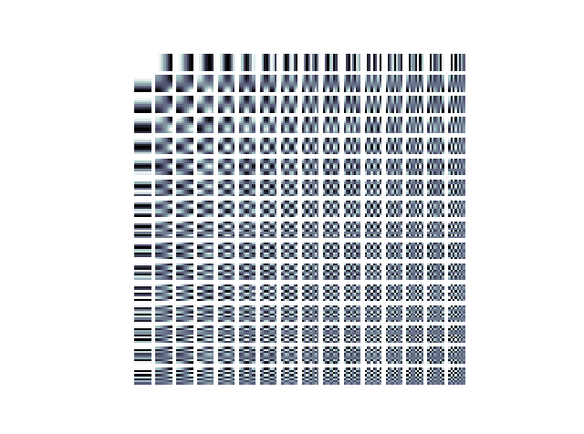
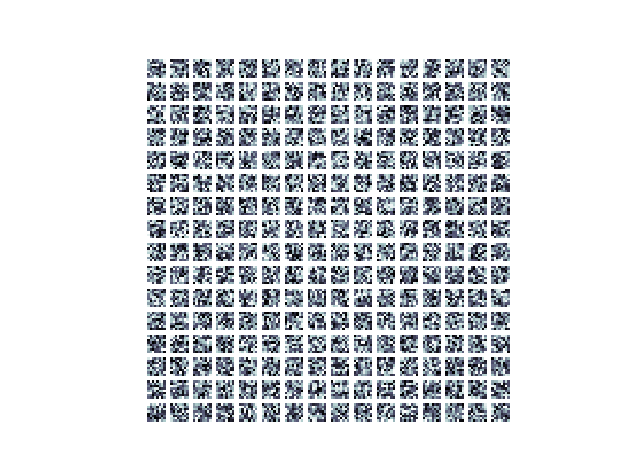
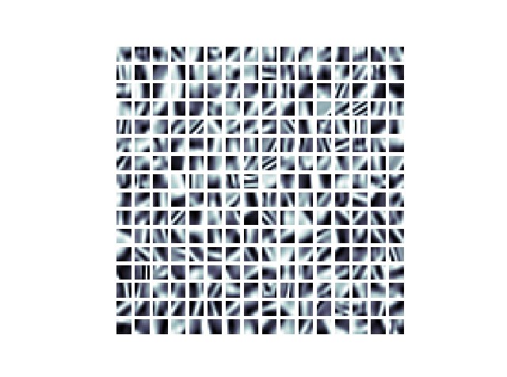
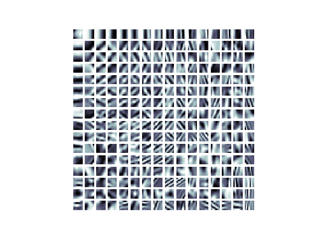

.. _numpy: http://www.numpy.org/
.. _least squares: https://en.wikipedia.org/wiki/Linear_least_squares_(mathematics)

Dictionary learning tutorial
============================

Simply put dictionary learning is the method of learning a matrix, called
a dictionary, such that we can write a signal as a linear combination of as 
few columns from the matrix as possible.

When using dictionary learning for images we take advantage of the property that natural images can be represented in a sparse way.
This means that if we have a set of basic image features any image can be written as a linear combination of only a few basic features.
The matrix we call a *dictionary* is such a set. Each column of the dictionary is one basic image features.
In the litterature these feature vectors are called atoms.

We don't work on full images directly, but small image patches. An image patch is simply a small square from the image,
and when working with dictionary learning we normally extract all overlapping image patches. If we want to work on patches
of size `(8, 8)` we start at `image[0, 0]` and extraxt the first patch `patches[:, 0] = image[0:8, 0:8].flatten()` the
second patch will be `patches[:, 1] = image[0:8, 1:9].flatten()`. The inverse transformation, from image patches to
image is done adding each patch to its origination? location in the image and then averaging all values for
overlapping pixels.

>>> import dictlearn as dl
>>> image = dl.imread('examples/images/house.png')
>>> image_patches = dl.Patches(image, 8)
>>> matrix = image_patches.patches
>>> matrix.shape
(64, 62001)

With dictionary learning we want to find a dictionary, **D**, and a vector with coefficients for the linear combinations,
**y**. The vector of an image patches we'll denote by **x**. Then our goal is to find **D** and **y** such that the
error :math:`\| \mathbf{x} - \mathbf{Dy} \|_2` is small.
Before we said: *.. any image can be written as a linear combination of only a few basic features*.
This means **y** has to be sparse such that we only use a few of the available atoms in the dictionary.
We could try to minimize the error above and hope we get a sparse **y**, but the would almost certainly not work.
Something that does work is to add regularization. Regularization is a way to control how the terms we're
minimizing over behaves. In our case we need a type of regularization that is small when **y** is sparse and
large otherwise. We'll use :math:`\ell _0`-regularization, and the minimization problem becomes

.. math::
    \underset{\mathbf{D}, \;\mathbf{y}}{arg\:min} \quad \frac{1}{2} \| \mathbf{x} - \mathbf{Dy} \| ^2_2 + \lambda \|\mathbf{y} \| _0

Almost always we'll have have thousands of training signals that each should be represented with a sparse vector.
To make this easier we are going to organize our training data as columns in a big matrix **X** with the shape
`(signal_size, n_signals)`. Then we have the dictionary which is denoted by **D**. The shape of the dictionary is
`(signal_size, n_atoms)`. Finally we have the sparse representation which is the matrix **A** with shape
`(n_atoms, n_signals)`, where each column is the representation for the corresponding signal (column i **X**).
Now almost all the important parts are introduced and we can look at the definition of the
learning problem.

.. math::

    \underset{\mathbf{D} \in \mathcal{C},\; \mathbf{A}}{min} \quad
    \frac{1}{2}\left \| \mathbf{X} - \mathbf{DA} \right \|_F^2 +
    \lambda \Psi(\mathbf{A})

What this definition says is that we need to the dictionary and sparse representation that minimizes the two terms.
The first term measure the error between the real signals **X** and the reconstructed signals **DA**. This first term
is essentially the `least squares`_ problem. :math:`\left \|.\right \|_F` is the Frobenius norm

The second term is the interesting part. This is the regularization. With regularization we can alter the way the matrix
**A** behaves during the minimization. Since we want a sparse representation **A**, the function :math:`\Psi` needs
to be chosen such that the minimization above "prefers" **A** to be sparse. We need :math:`\Psi` to be a sparsity
inducing function. In this package two different functions are used. The first is the :math:`\ell _0`- norm which
counts the number of nonzero entries. The other is the :math:`\ell _1`-norm, this is the sum of the absolute values.
When using :math:`\ell _0`-norm we say the problem is :math:`\ell _0`- regularized, :math:`\ell _1` - regularized in the
other case.

Training
--------
The functions found in :doc:`optimize` are used to train the dictionary. All of these
algorithms work in two stages: (1) sparse coding with the current dictionary then (2) using
the sparse codes update the dictionary such that the new dictionary will better approximate
the image.

To start training we first need an initial guess for the dictionary. This can be pretty
much anything as long as the columns are normalized, but some choices give faster
convergence than others. One good dictionary is the one created using the *Discrete Cosine Transform* basis functions.

.. code-block:: python

    import dictlearn as dl
    dictionary = dl.dct_dict(256, 8)  # dl.dct_dict(n_atoms, patch_size)

The DCT dictionary looks like

.. code-block:: python

    dl.visualize_dictionary(dictionary, 16, 16)

Each box is one atom. The atoms are reshaped into the shape of the image patches for
better visualization.

A random dictionary can also be used. :code:`dl.random_dictionary(rows, columns)` samples
from a uniform distribution. This looks like

.. code-block:: python

    import dictlearn as dl
    dictionary = dl.random_dictionary(64, 256)
    dl.visualize_dictionary(dictionary, 16, 16)

The DCT dictionary will give very good results with no training. But training the
dictionary will always give better results. In :doc:`algorithms` a set of high level
interfaces are given to train a dictionary, and other methods (denoise, inpaint, ...).
Low level functions are found in :doc:`optimize`.  The easiest way to use an image to
train a dictionary is to use the class :code:`ImageTrainer`.

.. code-block:: python

    trainer = dl.ImageTrainer('examples/images/lena512.png', patch_size=8)
    trainer.dictionary = dictionary
    trainer.train(iters=100, n_nonzero=8, n_threads=4, verbose=True)

    dl.visualize_dictionary(trainer.dictionary, 16, 16)

After training the random dictionary above for 100 iterations it now looks like

The low level methods in :doc:`optimize` can also be used. Training the DCT dictionary
for 50 iterations will look like:

.. code-block:: python

    import dictlearn as dl

    image = dl.imread('examples/images/lena512.png').astype(float)
    image_patches = dl.Patches(image, 8) # Creates 8x8 image patches
    dictionary = dl.dct_dict(256, 8)  # Initial dictionary
    dictionary = dl.ksvd(image_patches, dictionary, 50, n_nonzero=8,
                         n_threads=4, verbose=True)

    dl.visualize_dictionary(dictionary, 16, 16)

Denoise
*******
Here we'll show how to denoise a grayscale (colors in future release) image using patch-based denoising. First, import the library

.. code-block:: python

    import dictlearn as dl

Then you can open an image and create an instance of the denoising class:

.. code-block:: python

    denoiser = dl.Denoise('path/to/noisy_image.png', patch_size=8, method='online')

The denoise class handles both training the dictionary and denoising the image (source: dictlearn/algorithms.py:Denoise).
The **first** parameter is the image data, this can be a path, image as a numpy array or an instance of `preprocess.Patches`.
The **second** is the size of one dimension in the image patches. As the patches are squares the total patch size in this case is 64, 8\*8.
The patch size will impact the blurriness of the denoised image, bigger patches gives more blur. More on this later. The **third** argument
is the training algorithm. The choices are `{'online', 'batch', 'ksvd'}`. *Online* training uses [ODL](#), while *batch* and *ksvd* both uses [K-SVD](#).
The difference between the last two is that *batch* uses an additional step with Orthogonal-MP after training to denoise the image, while *ksvd* uses
the sparse coefficients from training to denoise the image.

To train the dictionary, call the `train` method

.. code-block:: python

    denoiser.train()

Calling `train` without arguments like this will give good results for most cases. If you're using `method='ksvd'`, train require the argument *sigma* - the noise variance. You can pass the following keyword arguments to fine tune the training

- **iters**: Number of training iterations. 15 for *batch* or *ksvd* and 5000 for *online* are good starting points
- **n\_atoms**: Number of atoms (columns) in the dictionary. Optimally you want your sparse code to use all the atoms. A good default value is 2*total\_patch\_size. The complexity of the training algorithms with respect to the number of atoms is linear.
- **n\_nonzero**: Number of coefficients to use for sparse coding. Has to be atleast one, and cannot be larger than the number of atoms. **Check complexity OMP-Batch**. If you're using too many coefficients you might end up capturing the noise in the trained dictionary.
- **fill in the rest**

Finally, denoise the image:

.. code-block:: python

    denoised_image = denoiser.denoise(sigma=20, n_threads=4)

##### Image still has a lot of noise, what to do?
Try the following, the points has decreasing impact on the denoised image
1. Higher sigma
2. Bigger patches
3. Fewer n\_nonzero coeffs
4. Fewer atoms
5. More iterations

##### Image is very blurry, what to do?
Follow the points above, but do the opposite. Ie. *point one: Higher sigma* - you do **lower** sigma.

### Full example

.. code-block:: python

    import dictlearn as dl
    import matplotlib.pyplot as plt
    from scipy import misc

    # Set default pyplot colormat
    plt.rcParams['image.cmap'] = 'bone'

    clean = misc.imread('images/lena512.png').astype(float)
    noisy = misc.imread('images/lena_noisy512.png').astype(float)

    denoiser = dl.Denoise(noisy, patch_size=10, method='batch')
    denoiser.train(iters=40, n_nonzero=1, n_atoms=256, n_threads=4)
    denoised = denoiser.denoise(sigma=33, n_threads=4)

    plt.subplot(131)
    plt.imshow(clean)
    plt.axis('off')
    plt.title('Clean')

    plt.subplot(132)
    plt.imshow(noisy)
    plt.axis('off')
    plt.title('Noisy, psnr = {}'.format(dl.utils.psnr(clean, noisy, 255)))

    plt.subplot(133)
    plt.imshow(denoised)
    plt.axis('off')
    plt.title('Denoised, psnr = {}'.format(dl.utils.psnr(clean, denosied, 255)))
    plt.show()

Inpaint
*******
Mask

Upscaling
*********
Train two dictionaries

Compression
***********
Distribute compressed sparse codes along with the dictionary

